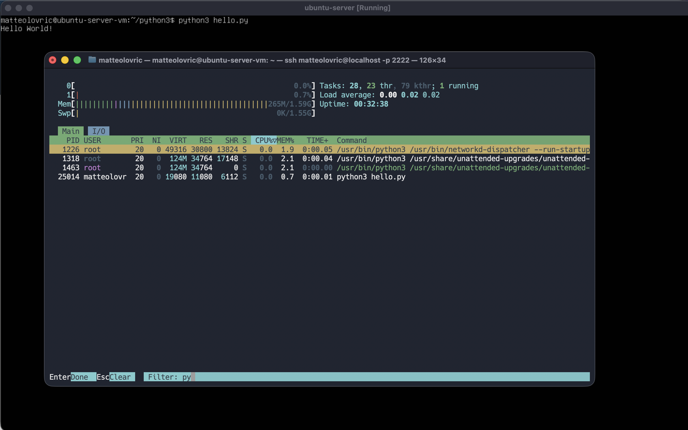
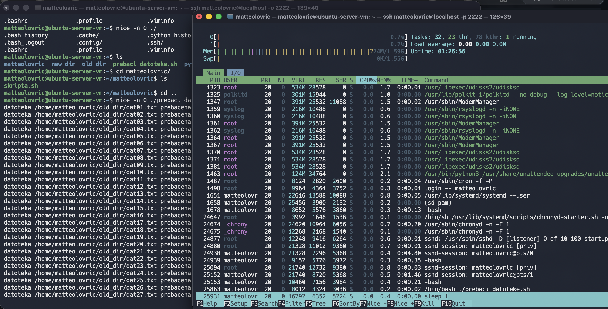
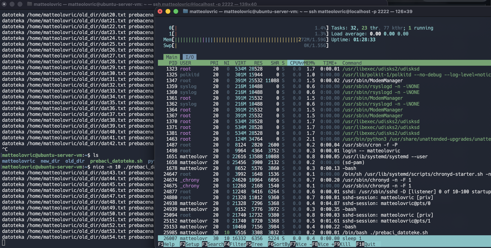
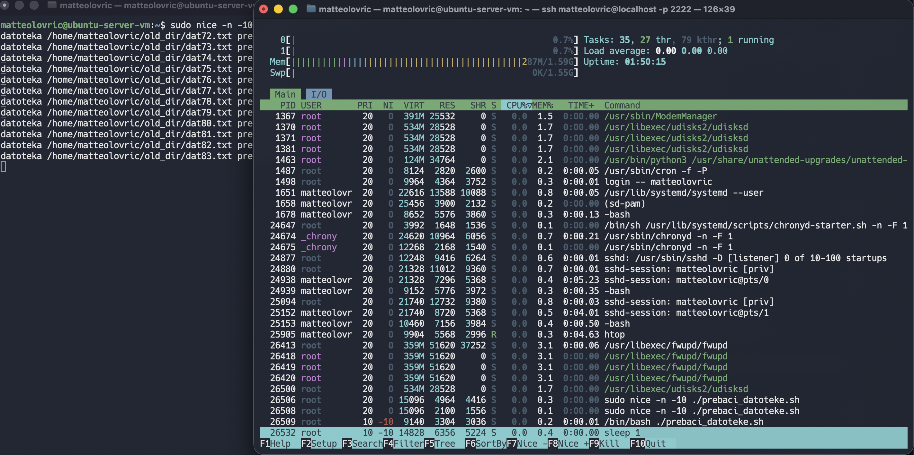
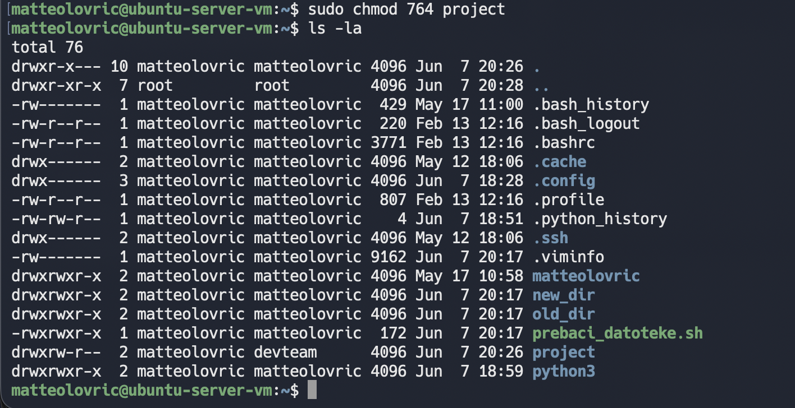
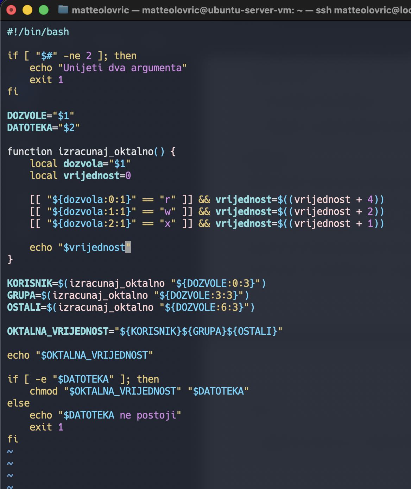
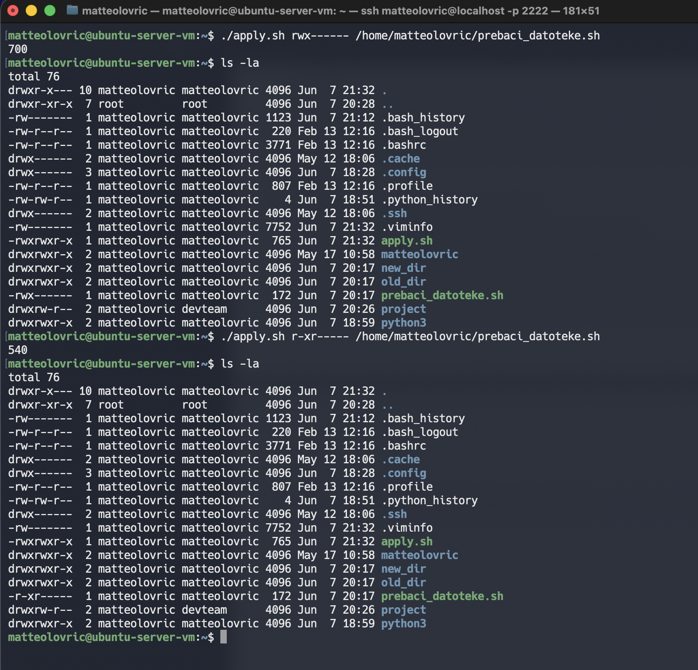

## Zadaća 5

### Zadatak 1

- PID = jedinstveni identifikator procesa = 25014
- USER = korisnik = matteolovr
- PRI = zadani prioritet 20
- NI = nice value 0 = obican proces
- VIRT = virtualna memorija = 19080KiB
- RES = fizicka memorija = 11080KiB
- SHR = fizicka memorija dijeljena s ostalim procesima = 6112KiB
- S = S = proces spava zbog sleep funkcije unutar skripte sleep(100)
- CPU = ne koristi cpu
- MEM = zauzima 0.7% memorije
- TIME = procesor je koristio 1 sekundu od pokretanja procesa

Proces mozemo ugasiti na tri nacina:

- kill -9 hello.py
- kill 25014
- killall python3

### Zadatak 2

nice -n 0 ./prebaci_datoteke.sh

nice -n 10 ./prebaci_datoteke.sh

sudo nice -n -10 ./prebaci_datoteke.sh

### Zadatak 3

- sudo groupadd devteam
- mkdir project
- sudo useradd -m -g devteam developer1
- sudo useradd -m -g devteam developer2
- sudo useradd -m -g devteam developer3
- sudo useradd -m -g devteam developer4
- sudo chown matteolovric:devteam project
- sudo chmod 764 project
  

### Zadatak 4

- rwxr-xr-x = 755 korisnik moze sve, grupa i ostali mogu citati i izvrsavati
- rw-r--r-- = 644 korisnik moze citati i pisati, grupa i ostali mogu citati
- rwx------ = 700 korisnik moze sve, grupa i ostali ne mogu nista
- rw-rw-r-- = 664 korisnik i grupa mogu citati i pisati, ostali mogu citati
- rwxrwxrwx = 777 korisnik grupa i ostali mogu sve
- r--r--r-- = 444 korisnik grupa i ostali mogu citati
- rw------- = 600 korisnik moze citati i pisati,grupa i ostali nemaju pristup

### Zadatak 5

